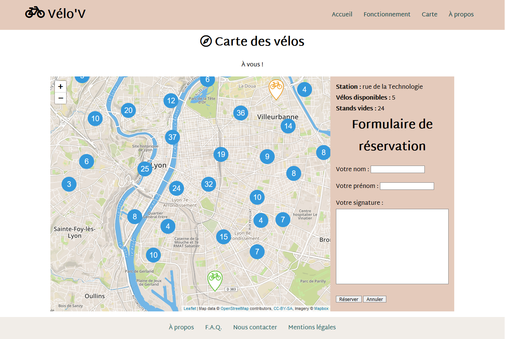

# Bike locator on interactive map in javascript :bike:

I've done this project "Carte interactive de location de vélos" during my training as a junior web developer, during 2019.

## The goal to achieve

A website where you can choose a station to rent a bike, and fill a form to complete your booking. A timer shows how much time you still have before your booking has expired. There is a slider that explains how the service works.

## How it's made
Vanilla CSS and javascript.
- a slider, an object
- map used : OpenStreetMap with Leaflet and Mapbox
- I made the custom markers on the map with Inkscape
- API used : JCDecaux for the bikes stations of the city of Lyon (France) on a JSON file, with AJAX
- they're click events on the map, and the booking form appears
- use of regex in order to verify first name and last name of the user
- use of the canvas API in order to let sign the user
- amp and booking are both objects
- use of sessionStorage and localStorage
- it's responsive